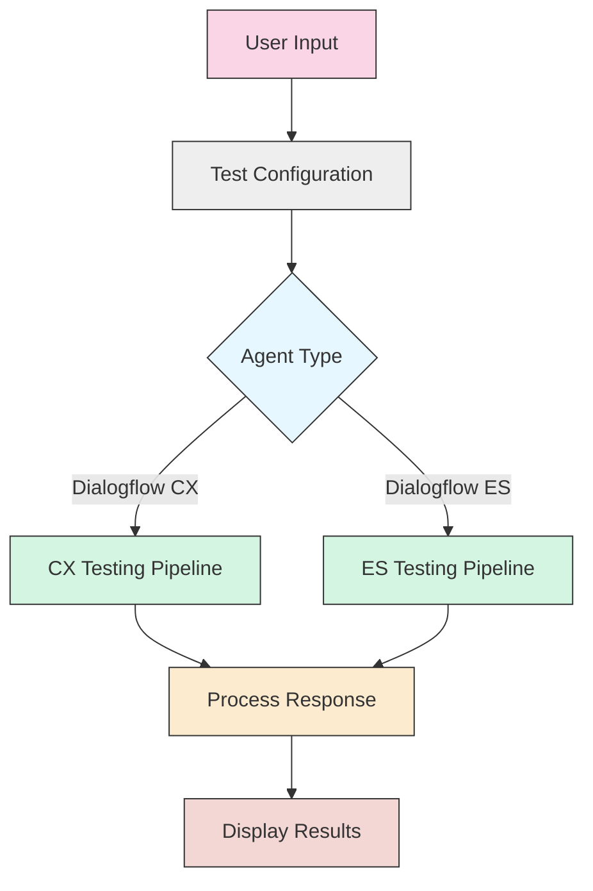

# 🤖 Dialogflow Testing Tools 🧪

<div align="center">
  
  
  
  
</div>

<div align="center">
  <p><strong>A modern web application for testing Dialogflow agents (CX & ES) with elegant UI and powerful features</strong></p>
</div>

## 📋 Table of Contents

- [✨ Overview](#-overview)
- [🛠️ Features](#️-features)
- [🚀 Getting Started](#-getting-started)
- [📊 Testing Capabilities](#-testing-capabilities)
- [🧩 Architecture](#-architecture)
- [🔍 Usage Examples](#-usage-examples)
- [⚙️ Configuration](#️-configuration)
- [📈 Project Structure](#-project-structure)

## ✨ Overview

<div align="center">
  <div style="position: relative; padding-bottom: 56.25%; height: 0;">
    <a href="https://www.loom.com/embed/b7ddf774e05240f996e033c13793f77f?sid=efa37ab9-5b91-482d-b7c6-43bc0359dacc" target="_blank">
      
    </a>
  </div>
  <p><em>Click on the image to watch the demo video</em></p>
</div>

Dialogflow Testing Tools is a comprehensive web application designed to help developers test and validate both Dialogflow CX and ES agents. This tool provides an intuitive interface for sending test queries, evaluating responses, and improving conversational AI experiences.

## 🛠️ Features

<div align="center">
  <table>
    <tr>
      <th>Feature</th>
      <th>Description</th>
    </tr>
    <tr>
      <td>🔄 Dual Platform Support</td>
      <td>Test both Dialogflow CX and ES agents from a single interface</td>
    </tr>
    <tr>
      <td>📝 Interactive Testing</td>
      <td>Send queries and view formatted JSON responses in real-time</td>
    </tr>
    <tr>
      <td>🌐 Multi-language Support</td>
      <td>Test agents in various languages to ensure global coverage</td>
    </tr>
    <tr>
      <td>🎯 Intent Validation</td>
      <td>Verify intent matching and parameter extraction</td>
    </tr>
    <tr>
      <td>🔍 Response Analysis</td>
      <td>Detailed breakdown of agent responses and fulfillment</td>
    </tr>
    <tr>
      <td>🌙 Dark Mode Support</td>
      <td>Comfortable testing experience in all lighting conditions</td>
    </tr>
  </table>
</div>

## 🚀 Getting Started

### Prerequisites

- Node.js (v14 or later)
- Google Cloud Platform account with Dialogflow API enabled
- Dialogflow CX or ES agent

### Installation Steps

```bash
# Clone the repository
git clone https://github.com/Yash-Kavaiya/Dialogflow-Testing.git
cd Dialogflow-Testing/dialogflow-testing-tools

# Install dependencies
npm install

# Start the development server
npm start
```

Your application will be available at http://localhost:3000

## 📊 Testing Capabilities



### Testing Process

1. **Configuration**: Enter your Project ID, Agent ID, and Location (for CX)
2. **Query Input**: Type your test utterance or phrase
3. **Processing**: Send request to Dialogflow API
4. **Analysis**: Review the structured response
5. **Iteration**: Refine your agent based on test results

## 🧩 Architecture

<div align="center">
  <table>
    <tr>
      <th colspan="2">Component Architecture</th>
    </tr>
    <tr>
      <td width="200"><strong>Frontend</strong></td>
      <td>
        • React with TypeScript<br>
        • Tailwind CSS for styling<br>
        • React Router for navigation
      </td>
    </tr>
    <tr>
      <td><strong>API Integration</strong></td>
      <td>
        • Dialogflow CX API<br>
        • Dialogflow ES API<br>
        • RESTful service architecture
      </td>
    </tr>
    <tr>
      <td><strong>State Management</strong></td>
      <td>
        • React hooks for local state<br>
        • Context API for global state (planned)
      </td>
    </tr>
    <tr>
      <td><strong>Testing</strong></td>
      <td>
        • Jest for unit testing<br>
        • React Testing Library for component testing
      </td>
    </tr>
  </table>
</div>

## 🔍 Usage Examples

### Basic Testing

<blockquote>
<p>💡 <strong>Tip:</strong> Start with simple queries to verify basic functionality before testing more complex scenarios.</p>
</blockquote>

1. Select your agent type (CX or ES)
2. Enter your Google Cloud Project ID
3. Provide your Agent ID (and location for CX agents)
4. Enter a test query (e.g., "Hello" or "I need help")
5. Click "Run Test"
6. Review the formatted JSON response

### Advanced Testing Scenarios

| Scenario | Test Input | What to Verify |
|----------|------------|----------------|
| Intent Recognition | "What's the weather like today?" | Correct intent matching |
| Entity Extraction | "Book a meeting on June 15th at 2pm" | Date and time parameters |
| Fallback Handling | "xyzabcdefg" | Proper fallback behavior |
| Context Management | Multi-turn conversation | Context persistence |
| Webhook Integration | "Process my order" | Fulfillment responses |

## ⚙️ Configuration

The application works with standard Dialogflow configuration parameters:

- **Project ID**: Your Google Cloud project identifier
- **Agent ID**: The unique identifier for your Dialogflow agent
- **Location**: Geographic location (for Dialogflow CX only)
- **Language Code**: ISO language code (defaults to en-US)

### Environment Setup

For backend integration, you'll need to set up authentication:

```
GOOGLE_APPLICATION_CREDENTIALS=/path/to/your/credentials.json
```

## 📈 Project Structure

```
dialogflow-testing-tools/
├── public/                # Static assets
├── src/
│   ├── components/        # React components
│   │   ├── Home.tsx       # Main testing interface
│   │   ├── About.tsx      # About page
│   │   ├── Header.tsx     # Navigation header
│   │   └── ...
│   ├── services/          # API services
│   │   └── dialogflowService.ts # Dialogflow API integration
│   ├── App.tsx            # Main application component
│   ├── index.tsx          # Entry point
│   └── ...
├── package.json           # Dependencies and scripts
└── README.md              # Project documentation
```

---

<div align="center">
  <p>📫 <strong>Have questions or feedback?</strong> Open an issue on GitHub or contribute to the project!</p>
  <p>⭐ <strong>If you find this tool useful, please star the repository!</strong> ⭐</p>
  <p>Built with ❤️ by <a href="https://github.com/Yash-Kavaiya">Yash Kavaiya</a></p>
</div>
